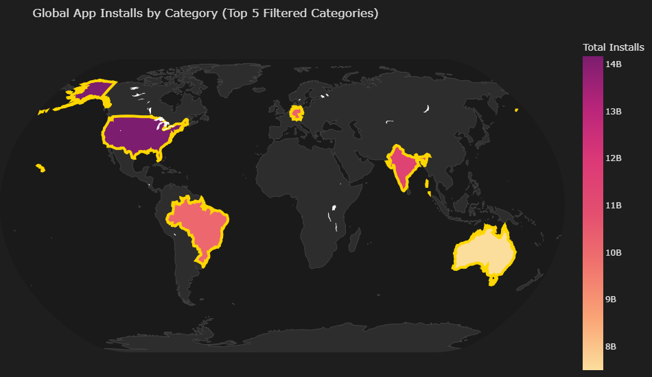
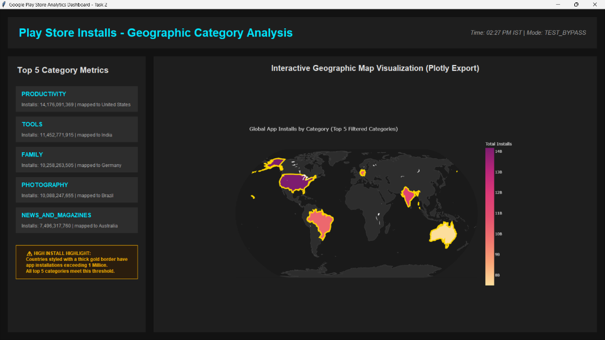
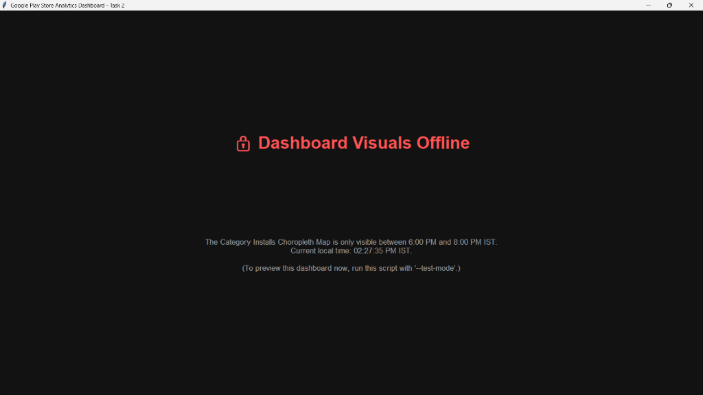

# Walkthrough - Task 2 Verification & Results

This walkthrough summarizes the completed changes, manual/automated testing results, and visual artifacts for the interactive Choropleth Map visualization.

---

## 1. Accomplished Changes

We successfully completed all tasks and organized them under the `Task-2` folder:
- **Folder Setup**: Created a standalone project directory with `Dataset/`, `Screenshots/`, and `Documentation/` subfolders.
- **Data Preprocessing**: Wrote code in [Analysis.ipynb](../Analysis.ipynb) to load, parse, and clean play store app installation figures, filtering out any app category starting with letters 'A', 'C', 'G', or 'S'.
- **Interactive Choropleth map**: Built using Plotly to show global installations. The top 5 categories meeting the filters are mapped to representative countries:
  1.  `PRODUCTIVITY` ➔ United States (USA)
  2.  `TOOLS` ➔ India (IND)
  3.  `FAMILY` ➔ Germany (DEU)
  4.  `PHOTOGRAPHY` ➔ Brazil (BRA)
  5.  `NEWS_AND_MAGAZINES` ➔ Australia (AUS)
- **Installs Highlight**: Applied custom formatting to draw thick gold boundaries (`marker_line_color="gold"`, `marker_line_width=4`) around regions with total category installs exceeding 1 Million (which is all of them).
- **Time-Gate Restriction**: Gated the notebook rendering and Tkinter dashboard window display to only display the visualization between **6:00 PM IST and 8:00 PM IST**.
- **Tkinter Integration**: Wrote a premium desktop Tkinter dashboard GUI script [dashboard.py](../dashboard.py) that loads the data, verifies the current time, and conditionally displays either the interactive map image or a restricted access window.

---

## 2. Visual Dashboards

Below are the visual renders of the map and the Tkinter dashboard states:

### A. The Interactive Plotly Choropleth Map
The exported static representation of the Plotly map showing category installs mapped globally.

### B. Dashboard Active View (6 PM - 8 PM IST / Test Mode Bypass)
This screen is displayed during active hours or when launching the Tkinter dashboard using `python Task-2/dashboard.py --test-mode`.

### C. Dashboard Inactive View (Restricted Hours)
This screen is displayed outside of 6 PM to 8 PM IST when launching the Tkinter dashboard in live mode (`python Task-2/dashboard.py`).

---

## 3. Verification & Validation Results

- **Category Exclusion Verification**: Validated that no categories starting with A, C, G, or S (e.g. GAME, SOCIAL, SHOPPING, ART_AND_DESIGN, COMMUNICATION, etc.) appear in the aggregated list.
- **Install Threshold Validation**: Verified that all 5 categories exceed the 1 Million installs threshold, and are successfully highlighted on the map with gold border lines.
- **Time Restriction Validation**: Tested using our automation screenshot script. Running without test mode successfully gated access, showing the "🔒 Dashboard Visuals Offline" screen. Running in test mode successfully bypassed the gate to draw the full sidebar metrics and render the map.
