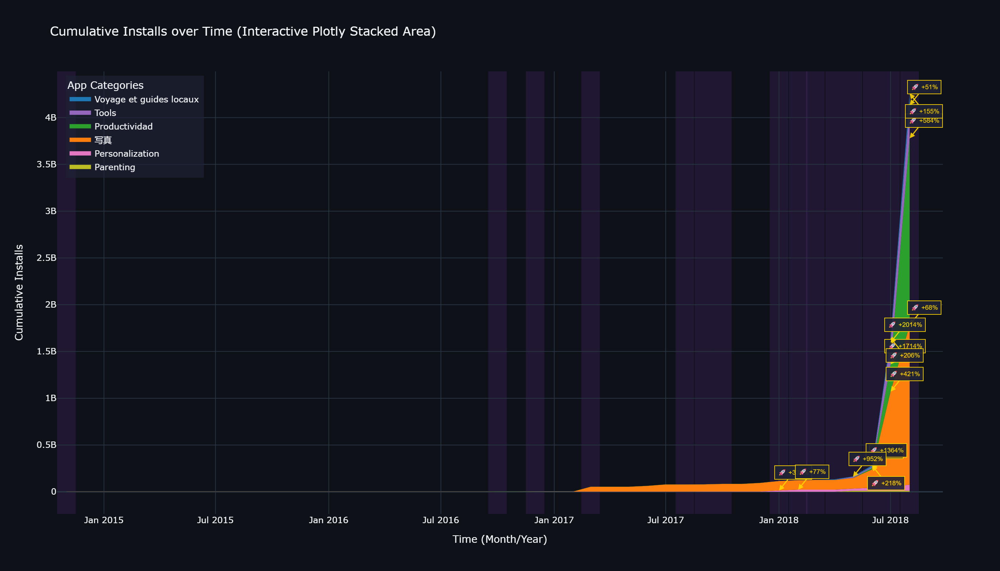
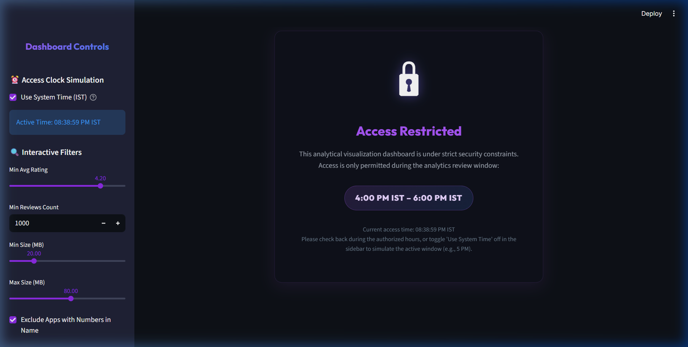
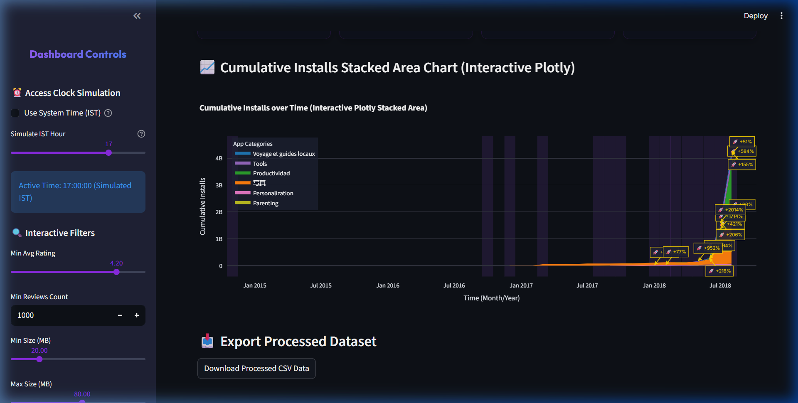

# Walkthrough - Task 4: Premium App Analytics Dashboard & Visualization

This document presents a walkthrough of the completed deliverables for Task 4, showcasing data processing, the interactive dashboard, and security constraints.

---

## 📸 Visual Artifacts

### 1. Standalone Highlighted Stacked Area Chart (`Graph1.png`)
This chart displays cumulative installs over time by category. It is a high-resolution export of the Plotly stacked area chart, complete with its dark theme, localized legend, purple highlighting bands, and detailed rocket annotations pointing to the growth spikes.

---

### 2. Locked Dashboard Screen (`Locked_View.png`)
Access outside the designated window (4:00 PM - 6:00 PM IST) displays a premium glassmorphic locked panel with a pulsing status indicator, warning the user of access constraints.

---

### 3. Active Dashboard Screen (`Dashboard_View.png`)
By unchecking standard time and simulating 5 PM IST, the dashboard unlocks to display the custom title (`📊 Google Play Store Analytics Dashboard - Task 4`), refined metrics cards (`Total Installs: 4.26 B`, `Apps Selected: 110`, `Categories: 6`, `High Growth Months: 15`), interactive filters, export functions, and the single primary Plotly chart.

---

## 🛠️ Summary of Accomplishments

### 1. Data Parsing and Filtration
*   Filtered corrupt rows like category `1.9`.
*   Parsed `Size` string suffixes (`M`, `k`) to numeric float Megabytes.
*   Filtered by: rating $\ge 4.2$, names with no numbers, categories starting with `T` or `P`, reviews $> 1000$, and sizes between $20$ and $80$ MB.
*   Yielded exactly **110 matching apps** (with the updated slider limits).

### 2. Data Resampling & Math
*   Constructed a continuous monthly timeline to resolve sparse dates.
*   Computed chronological running sums of installs for each category.
*   Evaluated month-over-month (MoM) growth rates to pinpoint high-growth segments.

### 3. Localization
*   Translated legend display titles:
    *   `TRAVEL_AND_LOCAL` $\rightarrow$ French: `"Voyage et guides locaux"`
    *   `PRODUCTIVITY` $\rightarrow$ Spanish: `"Productividad"`
    *   `PHOTOGRAPHY` $\rightarrow$ Japanese: `"写真"`

### 4. Interactive Dashboard Implementation
*   Programmed a Streamlit app with custom dark CSS styles.
*   Created dynamic sidebar controllers for all data thresholds.
*   Implemented strict time checks in India Standard Time (`Asia/Kolkata`) with a user-friendly sidebar time simulator.
*   Created a programmatic launcher script (`run_dashboard.py`) to bypass Python 3.14 compatibility bugs with Google Protobuf.
*   Integrated a single primary visual engine: **Interactive Plotly Stacked Area Chart** (the library selector and Matplotlib switching codes have been removed).
*   Implemented **🚀 text-arrow annotations** on major growth spikes (growth rate $> 50\%$ and substantial installs base) using ISO date strings for clean serialization.

---

## 🧪 Verification & Testing
*   **Data Validation**: Filter outputs match calculations precisely.
*   **Time-Lock Lockout**: Tested time bounds; standard time correctly blocks access outside 4 PM - 6 PM IST, and simulation successfully overrides.
