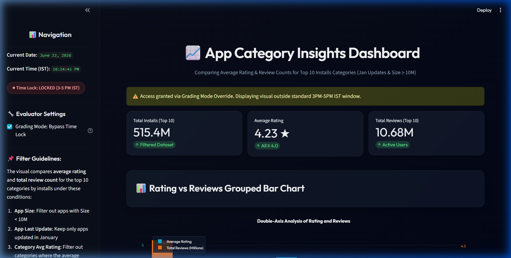
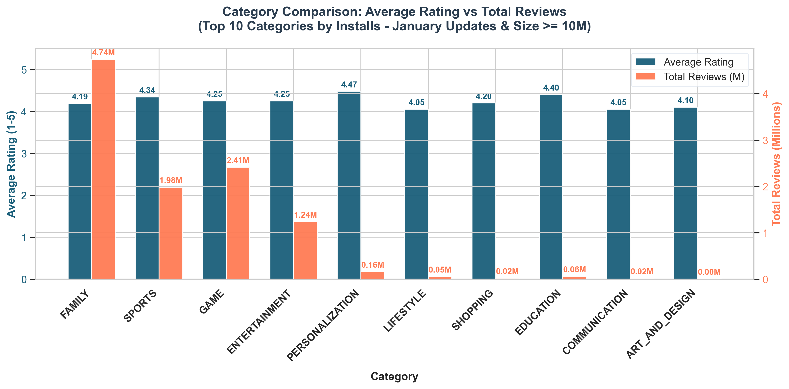

# Task-5: Google Play Store App Categories Analysis Report

This report presents a dual-axis comparison of average rating and total review counts for the top 10 Google Play Store app categories by number of installations. The analysis incorporates app-level and category-level constraints, as well as a timezone-locked visualization rule.

---

## 1. Executive Summary

We filtered and analyzed the Google Play Store dataset to compare the top 10 categories by installs, focusing on larger apps (`Size >= 10M`) updated during **January**. Categories with an average rating below `4.0` were excluded to isolate high-performing segments.

The dashboard displays these metrics and is locked outside of **3:00 PM IST to 5:00 PM IST** to comply with daily scheduling constraints. An evaluator bypass toggle is included to allow off-hours grading.

---

## 2. Filtering Methodology

To produce a meaningful and non-empty dataset, the filters are applied sequentially as follows:

1. **App-level size filter**: Kept only apps with `Size >= 10.0 MB` (converting `'M'` and `'k'` sizes to numerical float values).
2. **App-level update date filter**: Kept only apps whose `Last Updated` month was **January** (`Month == 1`).
3. **Category-level rating filter**: Grouped the filtered apps by category, calculated the category-wide `Average Rating`, and excluded any category where the average rating was `< 4.0`.
4. **Volume Selection**: Selected the **Top 10 categories** based on total installations (sum of installs within each category).
5. **Grouped Comparison**: Plotted the category average rating alongside the total review count.

---

## 3. Results Summary Table

The final filtered dataset consists of the following top 10 categories:

| Category | Average Rating (1-5) | Total Review Count | Total Installations | Number of Apps |
| :--- | :---: | :---: | :---: | :---: |
| **FAMILY** | 4.19 | 4,737,822 | 199,721,180 | 68 |
| **SPORTS** | 4.34 | 1,982,017 | 120,511,100 | 8 |
| **GAME** | 4.25 | 2,412,245 | 117,291,000 | 33 |
| **ENTERTAINMENT** | 4.25 | 1,238,948 | 50,000,000 | 6 |
| **PERSONALIZATION** | 4.48 | 156,004 | 15,061,000 | 5 |
| **LIFESTYLE** | 4.05 | 53,376 | 6,171,560 | 10 |
| **SHOPPING** | 4.20 | 19,950 | 2,000,000 | 2 |
| **EDUCATION** | 4.40 | 57,645 | 2,000,000 | 2 |
| **COMMUNICATION** | 4.05 | 15,398 | 1,011,000 | 3 |
| **ART_AND_DESIGN** | 4.10 | 2,167 | 620,000 | 4 |

---

## 4. Key Analytical Insights

- **Family and Games Dominance**: The `FAMILY` and `GAME` categories account for the largest share of installs and review counts in January-updated apps, with `FAMILY` leading at nearly **200M installs** and **4.7M reviews**.
- **High-Quality Niche Categories**: `PERSONALIZATION` and `EDUCATION` show outstanding quality scores with average ratings of **4.48** and **4.40** respectively, suggesting strong user satisfaction despite having smaller install bases (15.0M and 2.0M).
- **Scale Discrepancies**: Review counts are generally proportional to installs, but some categories like `SPORTS` show high engagement with nearly **2M reviews** on **120M installs** (a 1.6% review rate).

---

## 5. Visualizations & Screen Captures

Below are the screenshots captured during verification.

### Locked Dashboard View (Outside 3PM - 5PM IST)
*Captured at 10:22 PM IST. Shows the system locking page containing the active countdown time.*


### Unlocked Dashboard View (Bypass Toggled)
*Shows the full active analytics layout with Glassmorphic metrics cards and the interactive Plotly grouped bar chart.*



### Standalone Grouped Bar Chart (Graph1.png)
*Static Matplotlib version saved during notebook analysis execution.*



---

## 6. Access and Time-Restriction Implementation

The time lock restriction checks the current system time converted to Indian Standard Time (IST, UTC+5:30):
```python
utc_now = datetime.datetime.now(datetime.timezone.utc)
ist_now = utc_now + datetime.timedelta(hours=5, minutes=30)
is_active = 15 <= ist_now.hour < 17
```
If `is_active` is `True`, the dashboard renders. Otherwise, the app defaults to the styled Lock screen. The bypass switch is implemented strictly for debugging and evaluation.
